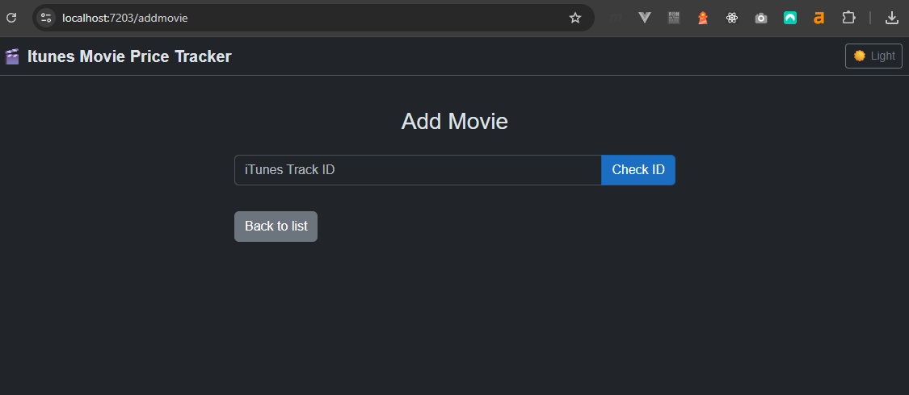

# 🎬 ItunesMoviePriceTracker


A Blazor Server application for monitoring iTunes movie HD and 4K prices. Track price history and set watch prices — all from a local IIS-hosted web app.

---

## Screenshots

| Movie List | Add Movie | Movie Detail |
|---|---|---|
|  |  |  |

---

## Features

- 📋 Browse all tracked iTunes movies in a sortable, filterable data grid
- 📈 Price history per movie with trend indicators (up / down / all-time low)
- 🎯 Set a personal watch price per movie
- 🔄 Scheduled price checks via Windows Task Scheduler
- 🖱️ Manual price update trigger from the UI
- 🌙 Dark / light mode with system theme detection and localStorage persistence
- 🔍 Filter by title and director

---

## Prerequisites

- [.NET 10 SDK](https://dotnet.microsoft.com/download/dotnet/10.0)
- [SQL Server](https://www.microsoft.com/en-us/sql-server/sql-server-downloads) (local or remote)
- [IIS](https://learn.microsoft.com/en-us/iis/get-started/introduction-to-iis/iis-web-server-overview) with ASP.NET Core Hosting Bundle installed
- [ASP.NET Core Hosting Bundle for .NET 10](https://dotnet.microsoft.com/en-us/download/dotnet/10.0)

---

## Getting Started

### 1. Clone the repository

```bash
git clone https://github.com/your-username/ItunesMoviePriceTracker.git
cd ItunesMoviePriceTracker
```

### 2. Configure the database

Update the connection string in both `appsettings.json` files (see [Configuration](#configuration) below).

### 3. Run the Web app locally

```bash
dotnet run --project src/ItunesMoviePriceTracker.Web
```

Or open `ItunesMoviePriceTracker.sln` in Visual Studio and press F5.

The database and all migrations are applied automatically on startup. If the database does not exist it will be created.

### 4. Set up the Update Service (optional)

To run price checks on a schedule, register the UpdateService with Windows Task Scheduler:

```bash
dotnet publish src/ItunesMoviePriceTracker.UpdateService -c Release -o publish/UpdateService
```

Then create a new task in Windows Task Scheduler pointing to:
```
publish/UpdateService/ItunesMoviePriceTracker.UpdateService.exe
```

Configure the trigger to run at your preferred times. Price checks can also be triggered manually from the Web UI via the Refresh button.

---

## Configuration

### `appsettings.json` (Web & UpdateService)

Both `ItunesMoviePriceTracker.Web` and `ItunesMoviePriceTracker.UpdateService` require a local `appsettings.json` that is **not committed to the repository**. Use `appsettings.example.json` as a template — copy it and rename it to `appsettings.json`:

```json
{
  "ConnectionStrings": {
    "DefaultConnection": "Server=YOUR_SERVER;Database=ItunesMovies;Trusted_Connection=True;TrustServerCertificate=True;"
  },
  "PriceCheck": {
    "ThrottleHours": 24,
    "StoreCountry": "se"
  },
  "DataProtection": {
    "KeyPath": "YOUR_KEY_PATH"
  },
  "Notifications": {
    "SmtpHost": "smtp.gmail.com",
    "SmtpPort": 587,
    "SmtpUser": "YOUR_EMAIL",
    "SmtpPassword": "YOUR_APP_PASSWORD",
    "ToEmail": "YOUR_EMAIL"
  },
  "AllowedHosts": "*"
}
```

Replace `YOUR_SERVER` with your SQL Server instance name, e.g. `localhost` or `.\SQLEXPRESS`.

`ThrottleHours` controls how many hours must pass before a movie is eligible for a new price check. Defaults to `24` if not set.

`StoreCountry` sets the iTunes store country code. Defaults to `se` (Sweden) if not set.

`DataProtection:KeyPath` sets the path where ASP.NET Core Data Protection keys are persisted. Example: `C:\\inetpub\\ItunesMoviePriceTracker\\keys`. The IIS app pool identity needs write access to this folder.

`Notifications` — SMTP settings for email notifications when a price drops below `WatchPrice`.

---

## IIS Setup

### 1. Install ASP.NET Core Hosting Bundle for .NET 10

Download and install from [dot.net/download](https://dotnet.microsoft.com/download/dotnet/10.0) then run:

```bash
iisreset
```

### 2. Create site folder and required subfolders

```bash
mkdir C:\inetpub\ItunesMoviePriceTracker
mkdir C:\inetpub\ItunesMoviePriceTracker\logs
mkdir C:\inetpub\ItunesMoviePriceTracker\keys
```

### 3. Grant IIS permissions

```bash
icacls "C:\inetpub\ItunesMoviePriceTracker" /grant "IIS_IUSRS:(OI)(CI)RX"
icacls "C:\inetpub\ItunesMoviePriceTracker\logs" /grant "IIS_IUSRS:(OI)(CI)F"
icacls "C:\inetpub\ItunesMoviePriceTracker\keys" /grant "IIS_IUSRS:(OI)(CI)F"
icacls "C:\inetpub\ItunesMoviePriceTracker\keys" /grant "IIS APPPOOL\ItunesMoviePriceTracker:(OI)(CI)F"
```

> Note: The last command uses the exact application pool identity. Replace `ItunesMoviePriceTracker` with your site name if different.

### 4. Grant SQL Server permissions

Run in SSMS:

```sql
USE master;
CREATE LOGIN [IIS APPPOOL\ItunesMoviePriceTracker] FROM WINDOWS;

USE ItunesMovies;
CREATE USER [IIS APPPOOL\ItunesMoviePriceTracker] FOR LOGIN [IIS APPPOOL\ItunesMoviePriceTracker];
ALTER ROLE db_datareader ADD MEMBER [IIS APPPOOL\ItunesMoviePriceTracker];
ALTER ROLE db_datawriter ADD MEMBER [IIS APPPOOL\ItunesMoviePriceTracker];
ALTER ROLE db_ddladmin ADD MEMBER [IIS APPPOOL\ItunesMoviePriceTracker];
```

### 5. Create IIS site

In IIS Manager → **Sites** → **Add Website**:
- **Site name:** `ItunesMoviePriceTracker`
- **Physical path:** `C:\inetpub\ItunesMoviePriceTracker`
- **Port:** `8080`

### 6. Configure Application Pool

In IIS Manager → **Application Pools** → `ItunesMoviePriceTracker` → **Advanced Settings**:
- **.NET CLR Version:** `No Managed Code`
- **Enable 32-Bit Applications:** `False`

### 7. Publish and deploy

Run as administrator:

```bash
iisreset /stop
dotnet publish src/ItunesMoviePriceTracker.Web -c Release -o C:\inetpub\ItunesMoviePriceTracker
iisreset /start
```

---


```
ItunesMoviePriceTracker/
├── ItunesMoviePriceTracker.sln
└── src/
    ├── ItunesMoviePriceTracker.Shared           # DTOs only
    ├── ItunesMoviePriceTracker.Repository       # EF Core, MSSQL, internal entities
    ├── ItunesMoviePriceTracker.Services         # Business logic, iTunes API, DI registration
    ├── ItunesMoviePriceTracker.Web              # Blazor Server (.NET 10), IIS hosted
    └── ItunesMoviePriceTracker.UpdateService    # Console App, Windows Task Scheduler
```

### Dependency Graph

```
Shared      ←  Services  ←  Web
                          ←  UpdateService
Repository  ←  Services
```

- `Shared` has zero dependencies — DTOs only
- `Repository` has zero dependencies on other projects — only EF Core NuGet packages
- `Services` references `Shared` and `Repository`, contains service interfaces, implementations and DI registration via extension methods
- `Web` and `UpdateService` reference `Shared` and `Services` only — `Repository` is wired up via DI in `Program.cs`

### Data Flow

```
Web → (interface in Shared) → Service → Repository → MSSQL
                                  ↑
                     EF entity mapped to DTO in Service layer
```

---

## Coding Conventions

| Convention | Choice |
|---|---|
| Constructors | Primary constructors (C# 12) |
| Async | Async/await throughout |
| Nullable | Nullable reference types enabled |
| Naming | PascalCase for classes/methods, camelCase for locals |

Example:
```csharp
// ✅ Primary constructor
public class MovieRepository(AppDbContext context, int throttleHours) : IMovieRepository
{
    public async Task<IEnumerable<Movie>> GetAllAsync()
        => await context.Movies.Include(m => m.Prices).OrderBy(m => m.TrackHdPrice).ToListAsync();
}

// ❌ Old style
public class MovieRepository : IMovieRepository
{
    private readonly AppDbContext _context;
    public MovieRepository(AppDbContext context) { _context = context; }
}
```

---

## Architecture & Key Decisions

| Area | Choice | Reason |
|---|---|---|
| Framework | .NET 10 / Blazor Server | Modern, interactive server rendering |
| Database | MSSQL (existing) | Preserves years of accumulated price data |
| ORM | EF Core Code First | Migrations handle schema changes cleanly |
| Hosting | IIS (local) | Consistent with existing setup |
| Price updates | Windows Task Scheduler + manual UI trigger | Simple, reliable, no external dependencies |
| iTunes data | iTunes Search API (Apple) | Proven, no scraping needed |
| HTTP | IHttpClientFactory | Best practice for HttpClient lifetime management |
| Theme | System detection + localStorage | Respects user preference, persists across navigation |
| Logging | Serilog with file sink | Daily rolling log files, EF Core noise filtered out |

### Layered Architecture

- `Shared` exposes only DTOs — no interfaces, no EF entities leak into Web
- `Repository` is fully internal — EF entities never leave the Repository layer
- `Services` owns all mapping between EF entities and DTOs
- `Services` owns DI registration via extension methods — `Web` and `UpdateService` call `builder.Services.AddMovieServices()` in `Program.cs` without knowing anything about `Repository`

### Price Trend

Trend is intentionally calculated in the UI layer (Blazor component), not in services. It is a display concern — no enum or helper needed. The `Trend` property is set on the DTO after data is loaded.

### iTunes API Behavior

- Store country configurable via `PriceCheck:StoreCountry` in `appsettings.json` (default `se`)
- 3-second delay between API calls — respects Apple rate limits
- Movies only checked if `LastChecked` is older than `ThrottleHours` (configurable, default 24h)

### Logging

Serilog is used for structured logging with a daily rolling file sink. EF Core database command logging is suppressed at `Warning` level to avoid noise. Log files are stored in the `logs/` folder of each deployed application and rotated daily with a 30-day retention policy.

On startup, `ApplyMigrationsAsync()` is called via `Program.cs`. This creates the database if it does not exist and applies any pending migrations automatically. No manual `dotnet ef database update` needed.

### Theme

Theme is managed entirely in JavaScript — Blazor never touches it. On page load, the saved `localStorage` value is applied. If no preference is saved, the system theme is used. The toggle button in the header persists the choice to `localStorage`.

---

## Database Schema

**dbo.Movies**

| Column | Type | Notes |
|---|---|---|
| TrackId | int PK | iTunes Track ID |
| TrackName | nvarchar(500) | Movie title |
| ReleaseDate | datetime2(7) | |
| ArtistName | nvarchar(255) | Director |
| LongDescription | nvarchar(2000) | |
| ArtworkUrl60 | nvarchar(500) | Thumbnail |
| ArtworkUrl400 | nvarchar(500) | Full artwork |
| TrackHdPrice | decimal(18,2) | Latest known price |
| LastChecked | datetime2(7) | Throttle control |
| WatchPrice | decimal(18,2) | Target watch price (nullable) |

**dbo.Prices**

| Column | Type | Notes |
|---|---|---|
| Id | int PK | |
| Date | datetime2(7) | UTC |
| Price | decimal(18,2) | |
| MovieTrackId | int FK | → dbo.Movies.TrackId |

---

## Future Considerations

- Multi-language support (UI layer, resource strings)
- Support for additional iTunes store countries
- Push notification when `TrackHdPrice` drops below `WatchPrice`

---

## License

This project is licensed under the [MIT License](LICENSE).