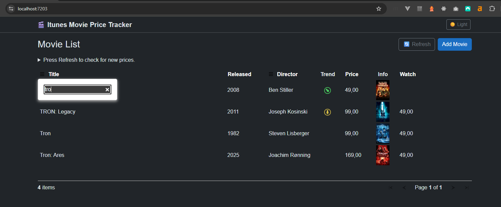
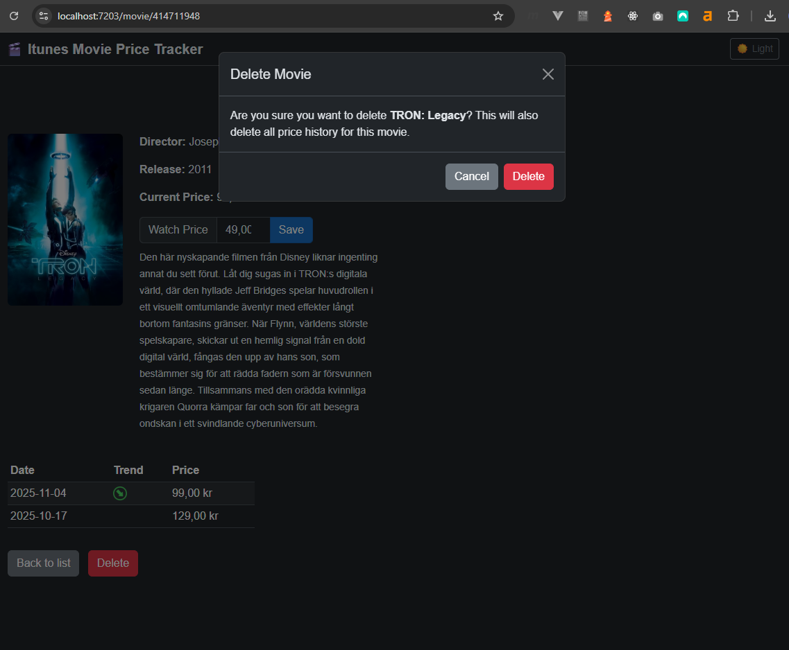

# 🎬 ItunesMoviePriceTracker


A Blazor Server application for monitoring iTunes movie HD prices. Track price history, set watch prices, and get notified when prices drop — all from a local IIS-hosted web app.

---

## Screenshots

> _Screenshots will be added once the UI is complete._

| Movie List | Movie Detail |
|---|---|
|  |  |

---

## Features

- 📋 Browse all tracked iTunes movies in a sortable, filterable data grid
- 📈 Price history per movie with trend indicators (up / down / all-time low)
- 🎯 Set a personal watch price per movie
- 🔄 Automatic price checks via Windows Task Scheduler
- 🖱️ Manual price update trigger from the UI
- ⏱️ Auto-refresh every 5 minutes
- 🔍 Filter by title and director

---

## Prerequisites

- [.NET 10 SDK](https://dotnet.microsoft.com/download/dotnet/10.0)
- [SQL Server](https://www.microsoft.com/en-us/sql-server/sql-server-downloads) (local or remote)
- [IIS](https://learn.microsoft.com/en-us/iis/get-started/introduction-to-iis/iis-web-server-overview) with ASP.NET Core Hosting Bundle installed
- [ASP.NET Core Hosting Bundle for .NET 10](https://dotnet.microsoft.com/en-us/download/dotnet/10.0)

---

## Getting Started

### 1. Clone the repository

```bash
git clone https://github.com/your-username/ItunesMoviePriceTracker.git
cd ItunesMoviePriceTracker
```

### 2. Configure the database

Update the connection string in both `appsettings.json` files (see [Configuration](#configuration) below).

### 3. Run EF Core migrations

```bash
dotnet ef database update --project src/ItunesMoviePriceTracker.Infrastructure --startup-project src/ItunesMoviePriceTracker.Web
```

> If the database already exists with data, the migration will only add the new `WatchPrice` column — all existing data is preserved.

### 4. Run the Web app locally

```bash
dotnet run --project src/ItunesMoviePriceTracker.Web
```

Or open `ItunesMoviePriceTracker.sln` in Visual Studio and press F5.

### 5. Set up the Update Service (optional)

To run price checks on a schedule, register the UpdateService with Windows Task Scheduler:

```bash
# Build the UpdateService
dotnet publish src/ItunesMoviePriceTracker.UpdateService -c Release -o publish/UpdateService
```

Then create a new task in Windows Task Scheduler pointing to:
```
publish/UpdateService/ItunesMoviePriceTracker.UpdateService.exe
```

Configure the trigger to run at your preferred times. The service can also be triggered manually from the Web UI.

---

## Configuration

### `appsettings.json` (Web & UpdateService)

Both `ItunesMoviePriceTracker.Web` and `ItunesMoviePriceTracker.UpdateService` require a connection string:

```json
{
  "ConnectionStrings": {
    "DefaultConnection": "Server=YOUR_SERVER;Database=ItunesMovies;Trusted_Connection=True;TrustServerCertificate=True;"
  },
  "Logging": {
    "LogLevel": {
      "Default": "Information",
      "Microsoft.AspNetCore": "Warning"
    }
  }
}
```

Replace `YOUR_SERVER` with your SQL Server instance name, e.g. `localhost` or `.\SQLEXPRESS`.

---

## Solution Structure

```
ItunesMoviePriceTracker/
├── ItunesMoviePriceTracker.sln
└── src/
    ├── ItunesMoviePriceTracker.Shared           # DTOs only
    ├── ItunesMoviePriceTracker.Repository       # EF Core, MSSQL, internal entities
    ├── ItunesMoviePriceTracker.Services         # Business logic, iTunes API, DI registration
    ├── ItunesMoviePriceTracker.Web              # Blazor Server (.NET 10), IIS hosted
    └── ItunesMoviePriceTracker.UpdateService    # Console App, Windows Task Scheduler
```

### Dependency Graph

```
Shared      ←  Services  ←  Web
                          ←  UpdateService
Repository  ←  Services
```

- `Shared` has zero dependencies — DTOs only
- `Repository` has zero dependencies on other projects — only EF Core NuGet packages
- `Services` references `Shared` and `Repository`, contains service interfaces, implementations and DI registration via extension methods
- `Web` and `UpdateService` reference `Shared` and `Services` only — `Repository` is wired up via DI in `Program.cs`

### Data Flow

```
Web → (interface in Shared) → Service → Repository → MSSQL
                                  ↑
                     EF entity mapped to DTO in Service layer
```

---

## Architecture & Key Decisions

| Area | Choice | Reason |
|---|---|---|
| Framework | .NET 10 / Blazor Server | Modern, interactive server rendering |
| Database | MSSQL (existing) | Preserves years of accumulated price data |
| ORM | EF Core Code First | Existing DB already uses EF migrations |
| Hosting | IIS (local) | Consistent with existing setup |
| Price updates | Windows Task Scheduler + manual UI trigger | Simple, reliable, no external dependencies |
| iTunes data | iTunes Search API (Apple) | Proven, no scraping needed |
| HTTP | IHttpClientFactory | Best practice for HttpClient lifetime management |

### Layered Architecture

- `Shared` exposes only DTOs — no interfaces, no EF entities leak into Web
- `Repository` is fully internal — EF entities never leave the Repository layer
- `Services` owns all mapping between EF entities and DTOs
- `Services` owns DI registration via extension methods — `Web` and `UpdateService` call `builder.Services.AddMovieServices()` in `Program.cs` without knowing anything about `Repository`

### Price Trend

Trend is intentionally calculated in the UI layer (Blazor component), not in services. It is a display concern — no enum or helper needed. The `Trend` property is set on the DTO after data is loaded.

### iTunes API Behavior

- Store country locked to `se` (Swedish iTunes store)
- 3-second delay between API calls — respects Apple rate limits
- Movies only checked if `LastChecked` is older than 4 hours

### Database Migration Strategy

Additive only — no destructive changes to existing tables. The only schema change from v1 is the addition of the nullable `WatchPrice` column on `dbo.Movies`.

---

## Database Schema

**dbo.Movies**

| Column | Type | Notes |
|---|---|---|
| TrackId | int PK | iTunes Track ID |
| TrackName | nvarchar(max) | Movie title |
| ReleaseDate | datetime2(7) | |
| ArtistName | nvarchar(max) | Director |
| LongDescription | nvarchar(max) | |
| ArtworkUrl60 | nvarchar(max) | Thumbnail |
| ArtworkUrl400 | nvarchar(max) | Full artwork |
| TrackHdPrice | decimal(18,2) | Latest known price |
| LastChecked | datetime2(7) | Throttle control |
| WatchPrice | decimal(18,2) | Target watch price (nullable) |

**dbo.Prices**

| Column | Type | Notes |
|---|---|---|
| Id | int PK | |
| Date | datetime2(7) | UTC |
| Price | decimal(18,2) | |
| MovieTrackId | int FK | → dbo.Movies.TrackId |

---

## Future Considerations

- Multi-language support (UI layer, resource strings)
- Support for additional iTunes store countries
- Push notification when `TrackHdPrice` drops below `WatchPrice`
- Optimize DB column sizes — replace `nvarchar(max)` with appropriate lengths (e.g. `nvarchar(500)` for `TrackName`, `nvarchar(255)` for `ArtistName`, `nvarchar(500)` for artwork URLs). `LongDescription` stays `nvarchar(max)`. Do this as a separate EF migration after the app is stable.

---

## License

This project is licensed under the [MIT License](LICENSE).